# Computer Vision Video Object Tracking – Label Studio

## Overview

This project demonstrates video object tracking using Label Studio for computer vision dataset creation. Multiple objects were tracked across consecutive video frames using bounding box annotations while maintaining temporal consistency and annotation quality.

The project includes three video tracking demonstrations, annotation screenshots, and exported JSON annotation data.

---

## Project Objectives

- Perform accurate video object tracking.
- Maintain consistent object identities across frames.
- Review and correct tracking results.
- Export annotations for machine learning workflows.

---

## Skills Demonstrated

- Video Object Tracking
- Bounding Box Annotation
- Multi-Object Tracking
- Frame-by-Frame Quality Assurance
- Annotation Review & Correction
- Dataset Export (JSON)
- Computer Vision Data Annotation

---

## Tools Used

- Label Studio
- JSON Export
- GitHub

---

# Video Demonstrations

This repository contains three object tracking demonstrations showing different tracking sequences and quality assurance workflows.

### 🎥 Video 1 – Object Tracking Demonstration

[▶️ Watch Video 1](videos/object.tracking.video1.video.mov)

### 🎥 Video 2 – Tracking Consistency & Refinement

[▶️ Watch Video 2](videos/object.tracking.video2.video.mov)

### 🎥 Video 3 – Final Reviewed Object Tracking

[▶️ Watch Video 3](videos/object.tracking.video3.video.mov)

---

# Annotation Export

The exported JSON annotation file is included to demonstrate the machine-readable output generated during the annotation process.

---

# Skills Developed

- Computer Vision
- Video Annotation
- Object Tracking
- Dataset Quality Assurance
- Annotation Export
- Machine Learning Dataset Preparation

## Screenshot Gallery

### Video 1

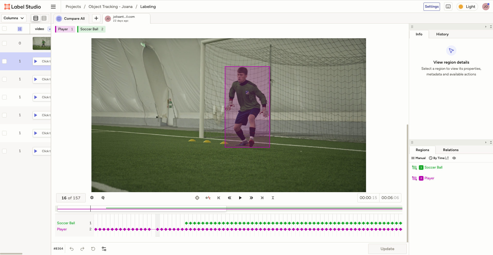

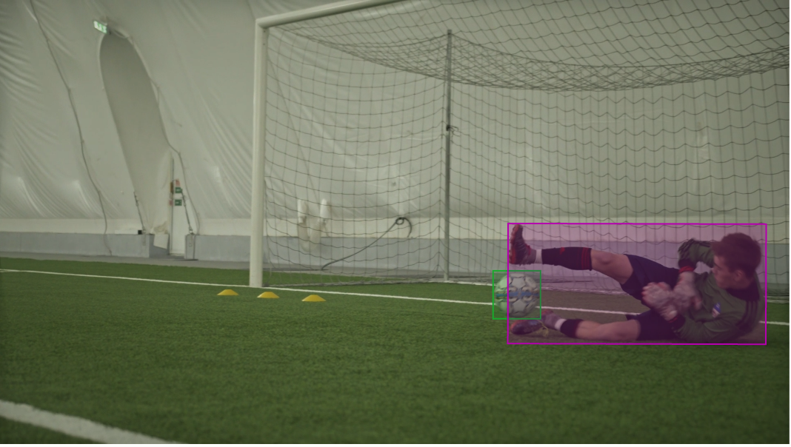

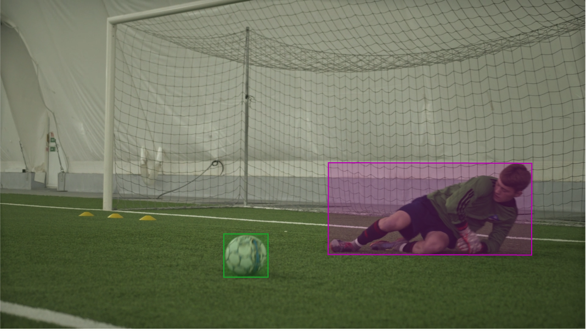

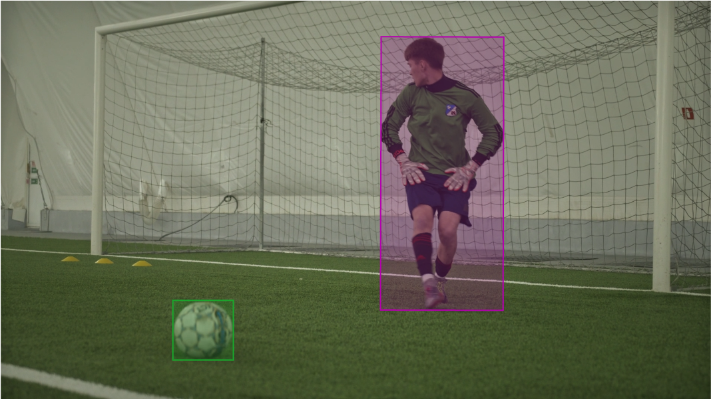

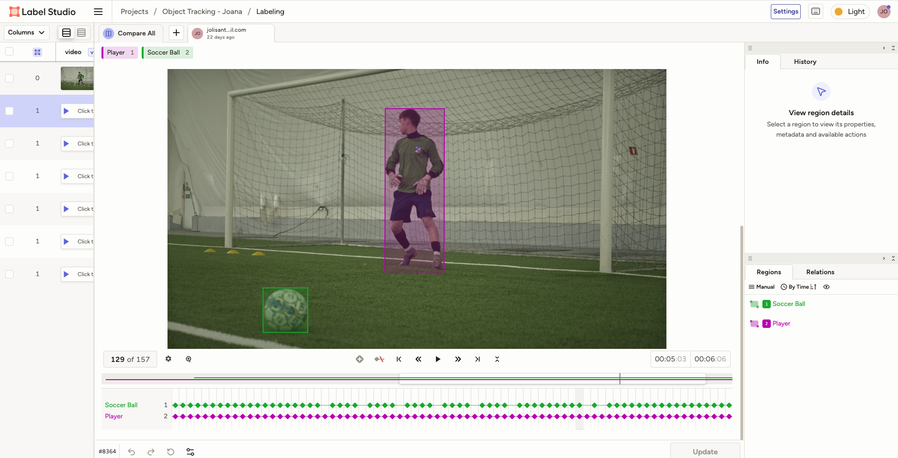

---

### Video 2

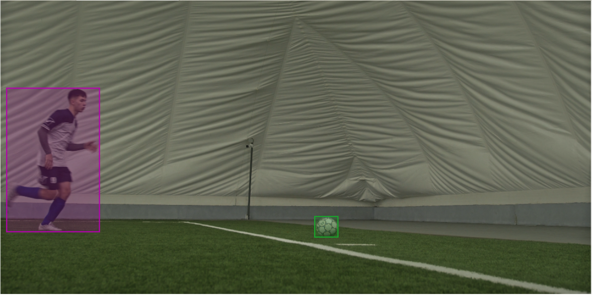

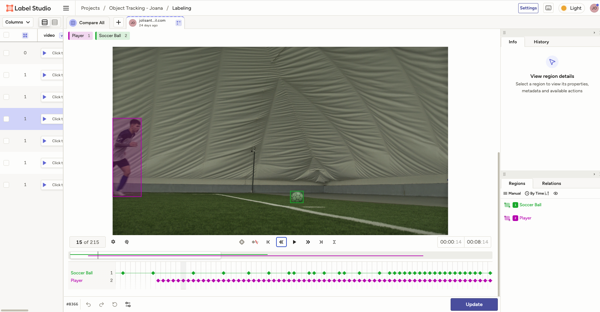

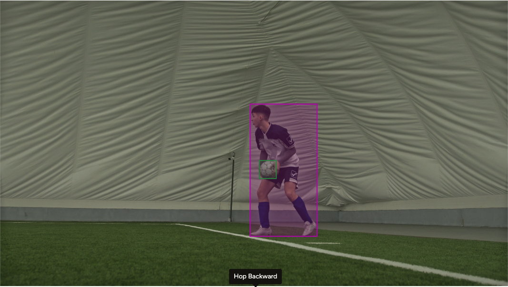

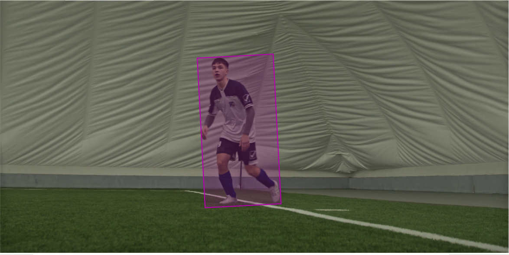

---

### Video 3

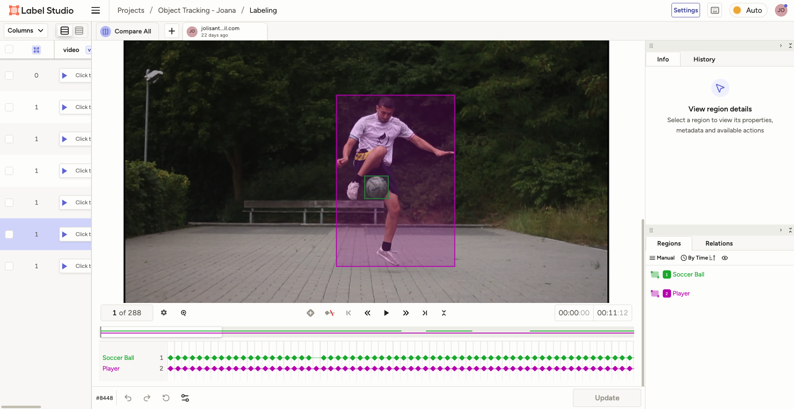

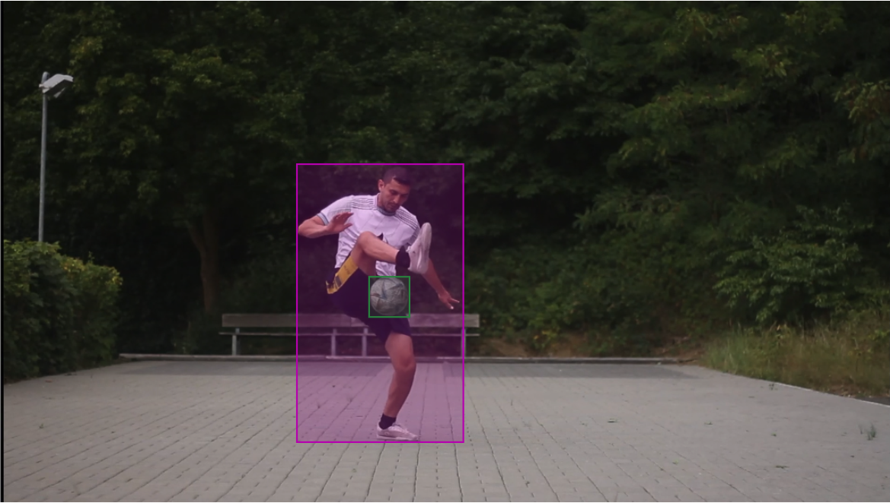

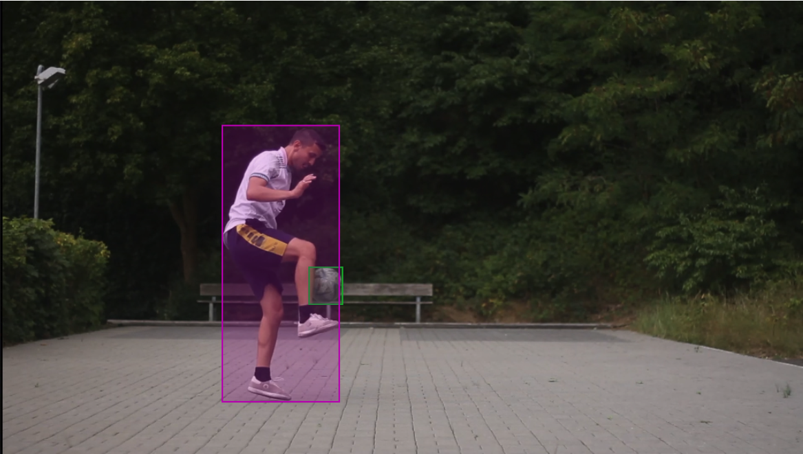

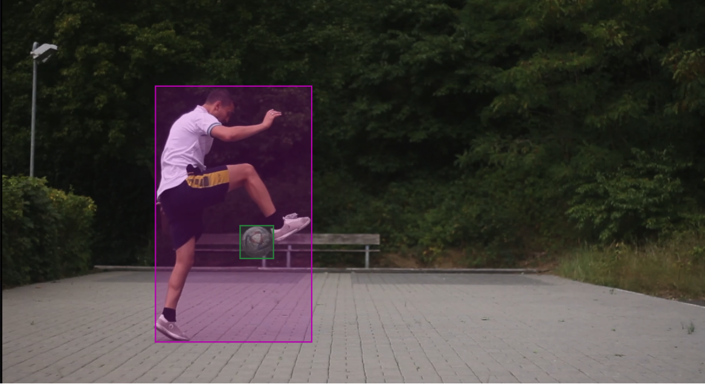

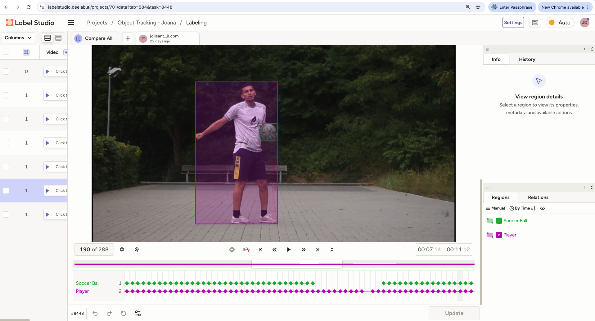
